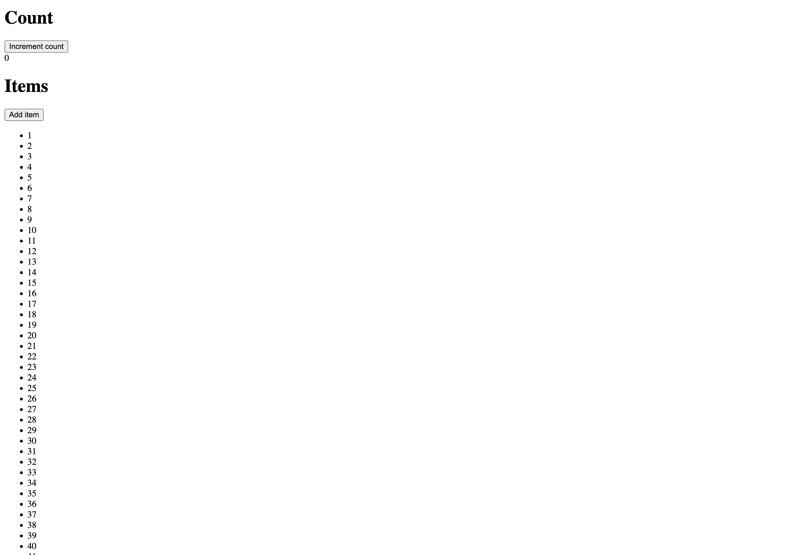

# React Compiler Demo

This project demos [the React Compiler](https://react.dev/learn/react-compiler) by featuring:

- A simple +1 counter
- A list of 10,000 items rendering
- A single component to host the state
- Redux to add the 10,000 items using an older `connect` API

## Before React Compiler

If we go through and:

- Add an item 2 times
- Increment the counter 2 times

And look at it through the React DevTools profiler, we can see that even when we change state unrelated to the items array, it will still cause a VDOM diff on the 10,000 items, leading to slow(er) performance:

## After React Compiler

Because the React Compiler optimizes state and comp via memoization, it's able to optimize the rendering of the 10,000 items when not interacting with them:

This optimization occured without _any_ code changes on our end in any way.